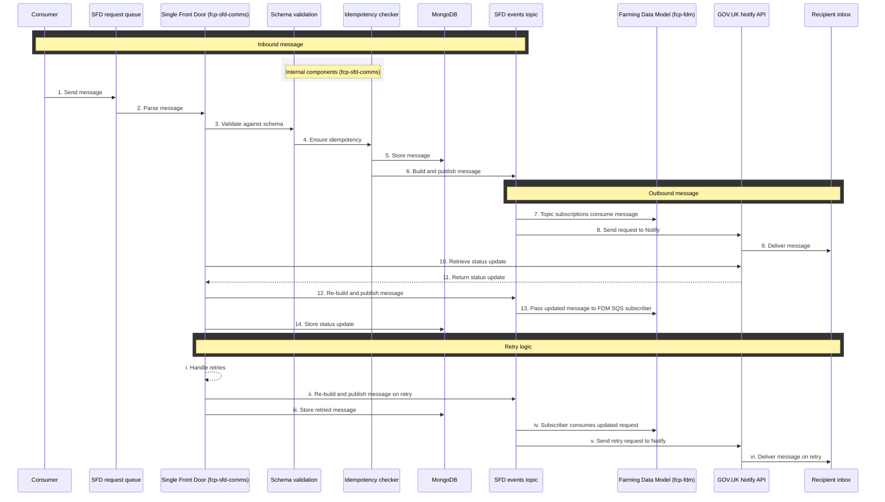
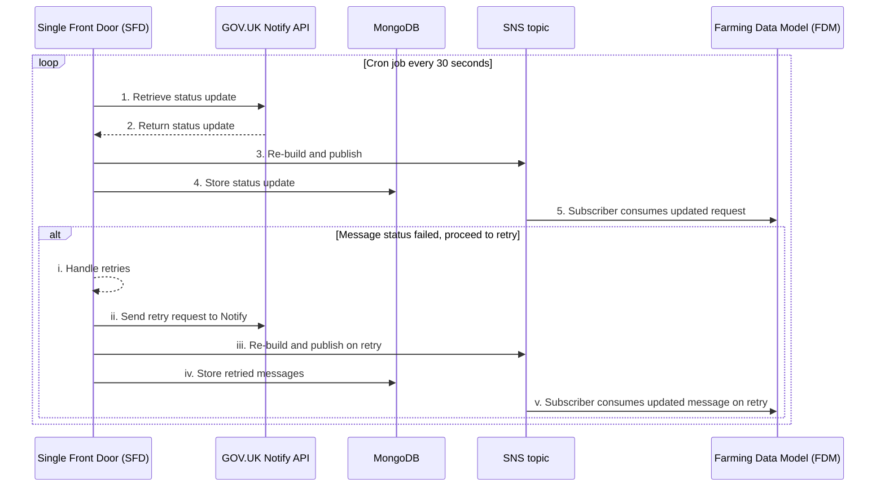

# fcp-sfd-comms

[](https://sonarcloud.io/summary/new_code?id=DEFRA_fcp-sfd-comms) 
[](https://sonarcloud.io/summary/new_code?id=DEFRA_fcp-sfd-comms)
[](https://sonarcloud.io/summary/new_code?id=DEFRA_fcp-sfd-comms)

Communications service for the Single Front Door.

This service is part of the [Single Front Door (SFD) service](https://github.com/DEFRA/fcp-sfd-core).

## Architecture overview

## Event processing pipeline

> **API Specification**  
> Complete AsyncAPI specification is available at: [`docs/asyncapi0-v1.0.yaml`](/docs/asyncapi-v1.0.yaml).  
> Defines all supported inbound events and schemas with examples provided.

### Processing flow inbound messages



### Message processing stages

1. Consumer sends request onto the Single Front Door (SFD) queue: `fcp_sfd_comms_request`.
2. Message is consumed and parsed by the SFD comms service: `fcp-sfd-comms`.
3. Comms service validates message against agreed schema specified in message contract.
4. Comms service checks the message is idempotent to prevent duplicate requests being sent.
5. On successful validation the message is stored in the SFD's comms database: `fcp_sfd_comms`.
6. Comms builds the message to then be published onto SFD's topic: `fcp_sfd_comm_events`.
7. All topic subscriptions will receive the message. The Farming Data Model (FDM) is currently the only subscriber to SFD's topic.  
8. Comms service sends a request to the GOV.UK Notify API alongside the built message which includes the Notify template ID.  
9. Message is delivered to the recipient.  
10. Comms service triggers a cron job every 30 seconds, sending a request to the Notify API for a status update on the message.  
11. Latest message status is returned to the comms service.  
12. Comms service will re-build the message with the updated status and publish this onto SFD's topic.  
13. All topic subscriptions (FDM) will receive the updated message.  
14. Updated message is stored in the comms database. 

Extended details on the cron job and retry logic is provided below.

### Processing flow for status update retrieval



### Status retrieval and retry logic stages

1. Cron job is triggered to run every 30 seconds. First stage is sending a request to the GOV.UK Notify API for a status update.
2. Notify API returns status update to SFD's comms service.
3. Comms service will re-build and publish the message with the status update onto the SFD topic.
4. Updated message is stored in SFD's comms database. 
5. All topic subscribers will also consume the updated message.

The `fcp-sfd-comms` service is also configured to handle retries (i) on any messages that fail to be delivered to the recipient. Requests are sent to the Notify API to retry sending the message (ii). In parallel to this, `fcp-sfd-comms` will re-build the message and publish it onto the SFD topic (iii) and store the message in the Mongo database (iv). All topic subscriptions (in this case FDM) will consume the message published onto SFD's topic (v). 

## Prerequisites
- Docker
- Docker Compose
- Node.js (v22 LTS)

## Environment variables
| Name | Default value | Required | Description |
|-|-|-|-|
| AWS_REGION | eu-west-2 | No | AWS region to access resources in. |
| AWS_DEFAULT_REGION | eu-west-2 | No | Default AWS region to access resources in. |
| AWS_ACCESS_KEY_ID | test | No | AWS Access Key ID. |
| AWS_SECRET_ACCESS_KEY | test | No | AWS Secret Access Key. |
| NOTIFY_API_KEY | n/a - sensitive | Yes | Notify API key to perform API requests to GOV.UK Notify. Generate a test API key for local development and testing on the [GOV.UK Notify portal](https://www.notifications.service.gov.uk/). |
| MONGO_URI | mongodb://mongo:27017/ | No | MongoDB connection string. |
| SQS_ENDPOINT | http://localstack:4566 | No | SQS endpoint. |
| SNS_ENDPOINT | http://localstack:4566 | No | SNS endpoint. |
| COMMS_REQUEST_QUEUE_URL | http://sqs.eu-west-2.127.0.0.1:4566/000000000000/fcp_sfd_comms_request | No | SQS queue URL to send comms requests. |
| COMMS_REQUEST_DEAD_LETTER_QUEUE_URL | http://sqs.eu-west-2.127.0.0.1:4566/000000000000/fcp_sfd_comms_request-deadletter | No | Comms Request SQS dead letter queue. |
| COMM_EVENTS_TOPIC_ARN | arn:aws:sns:eu-west-2:000000000000:fcp_sfd_comm_events | No | SNS topic ARN to publish comm events to. |
| FDM_QUEUE_URL | http://sqs.eu-west-2.127.0.0.1:4566/000000000000/fcp_fdm_events | No | SQS queue that is subscribed to the events SNS topic. |

## Running the application

We recommend using the [fcp-sfd-core](https://github.com/DEFRA/fcp-sfd-core) repository for local development. You can however run this service independently by following the instructions below.

#### Build container image

The service runs inside of a Docker container and the container image can be built using Docker Compose:
```
docker compose build
```

#### Start the container

Once built, the container is also started via Docker Compose: 

```
docker compose up -d
```

## Tests

### Test structure

The tests have been structured into subfolders of `./test` as per the
[Microservice test approach and repository structure](https://eaflood.atlassian.net/wiki/spaces/FPS/pages/1845396477/Microservice+test+approach+and+repository+structure).

### Running tests

An `npm` script is provided to run automated tests in a container. This will rebuild images before running tests via Docker Compose:

```
npm run docker:test
```

A watch script is also available which will run the test container, watch all test files for any changes, and re-run the tests in real time. This script is specifically designed to enable test driven development (TDD):

```
npm run docker:test:watch
```

## Licence

THIS INFORMATION IS LICENSED UNDER THE CONDITIONS OF THE OPEN GOVERNMENT LICENCE found at:

<http://www.nationalarchives.gov.uk/doc/open-government-licence/version/3>

The following attribution statement MUST be cited in your products and applications when using this information.

> Contains public sector information licensed under the Open Government license v3

### About the licence

The Open Government Licence (OGL) was developed by the Controller of His Majesty's Stationery Office (HMSO) to enable information providers in the public sector to license the use and re-use of their information under a common open licence.

It is designed to encourage use and re-use of information freely and flexibly, with only a few conditions.
