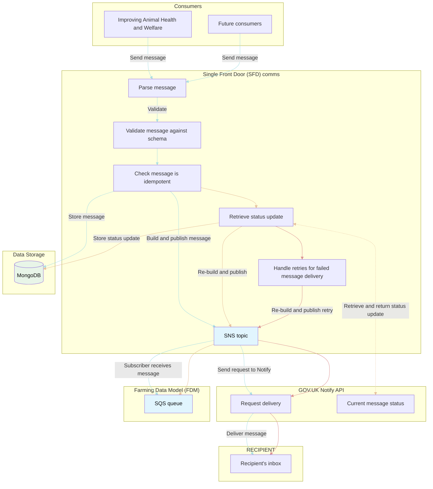
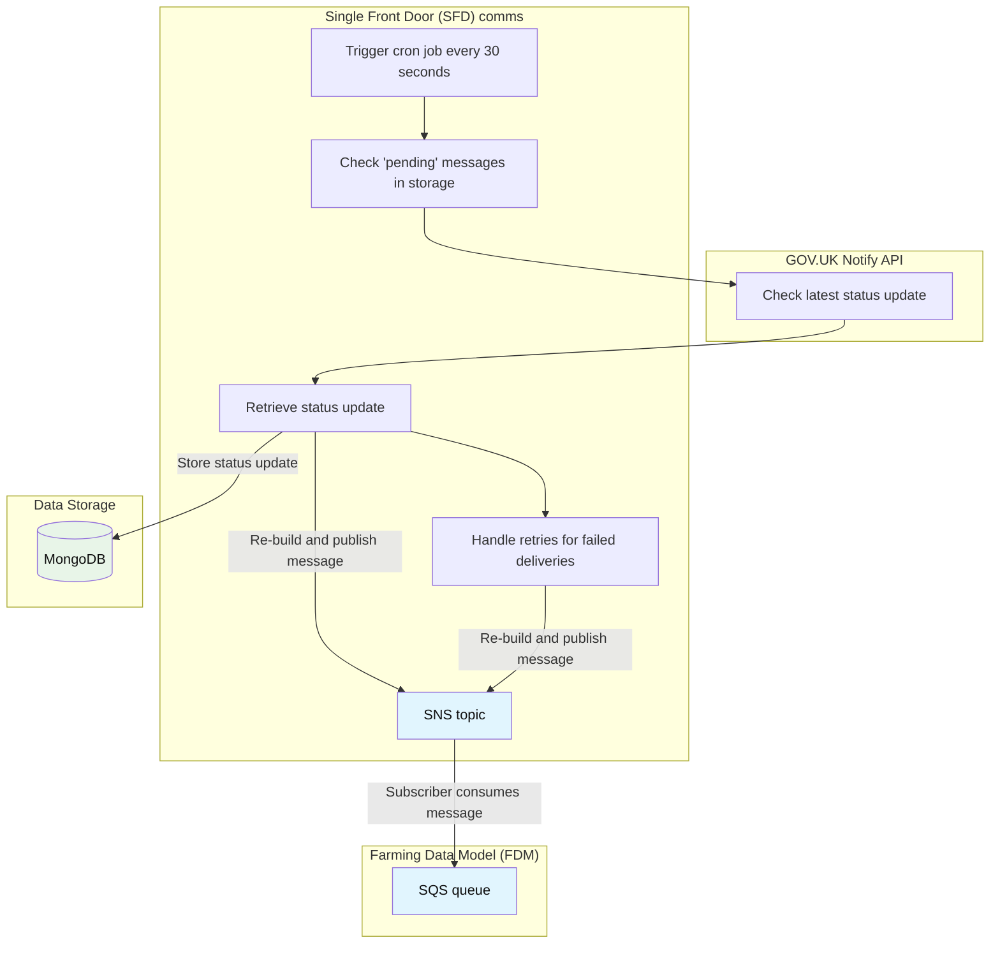
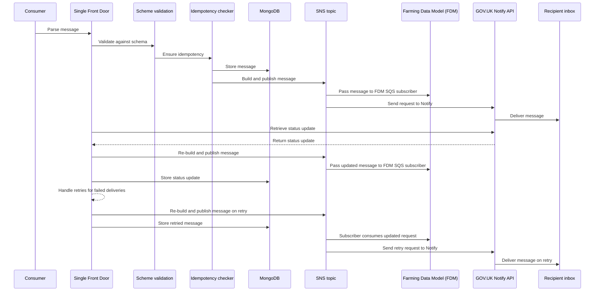

# fcp-sfd-comms

[](https://sonarcloud.io/summary/new_code?id=DEFRA_fcp-sfd-comms) 
[](https://sonarcloud.io/summary/new_code?id=DEFRA_fcp-sfd-comms)
[](https://sonarcloud.io/summary/new_code?id=DEFRA_fcp-sfd-comms)

Communications service for the Single Front Door.

This service is part of the [Single Front Door (SFD) service](https://github.com/DEFRA/fcp-sfd-core).

## Architecture overview

### Receiving and processing messages
Blue - happy path.  
Orange - retrieving status update (via cron job).  
Red - handling retries.


### Cron jobs


## Event processing pipeline

### Processing flow


## Prerequisites
- Docker
- Docker Compose
- Node.js (v22 LTS)

## Environment variables
| Name | Default value | Required | Description |
|-|-|-|-|
| AWS_REGION | eu-west-2 | No | AWS region to access resources in. |
| AWS_DEFAULT_REGION | eu-west-2 | No | Default AWS region to access resources in. |
| AWS_ACCESS_KEY_ID | test | No | AWS Access Key ID. |
| AWS_SECRET_ACCESS_KEY | test | No | AWS Secret Access Key. |
| NOTIFY_API_KEY | n/a - sensitive | Yes | Notify API key to perform API requests to GOV.UK Notify. Generate a test API key for local development and testing on the [GOV.UK Notify portal](https://www.notifications.service.gov.uk/). |
| MONGO_URI | mongodb://mongo:27017/ | No | MongoDB connection string. |
| SQS_ENDPOINT | http://localstack:4566 | No | SQS endpoint. |
| SNS_ENDPOINT | http://localstack:4566 | No | SNS endpoint. |
| COMMS_REQUEST_QUEUE_URL | http://sqs.eu-west-2.127.0.0.1:4566/000000000000/fcp_sfd_comms_request | No | SQS queue URL to send comms requests. |
| COMMS_REQUEST_DEAD_LETTER_QUEUE_URL | http://sqs.eu-west-2.127.0.0.1:4566/000000000000/fcp_sfd_comms_request-deadletter | No | Comms Request SQS dead letter queue. |
| COMM_EVENTS_TOPIC_ARN | arn:aws:sns:eu-west-2:000000000000:fcp_sfd_comm_events | No | SNS topic ARN to publish comm events to. |
| FDM_QUEUE_URL | http://sqs.eu-west-2.127.0.0.1:4566/000000000000/fcp_fdm_events | No | SQS queue that is subscribed to the events SNS topic. |

## Running the application

We recommend using the [fcp-sfd-core](https://github.com/DEFRA/fcp-sfd-core) repository for local development. You can however run this service independently by following the instructions below.

#### Build container image

The service runs inside of a Docker container and the container image can be built using Docker Compose:
```
docker compose build
```

#### Start the container

Once built, the container is also started via Docker Compose: 

```
docker compose up -d
```

## Tests

### Test structure

The tests have been structured into subfolders of `./test` as per the
[Microservice test approach and repository structure](https://eaflood.atlassian.net/wiki/spaces/FPS/pages/1845396477/Microservice+test+approach+and+repository+structure).

### Running tests

An `npm` script is provided to run automated tests in a container. This will rebuild images before running tests via Docker Compose:

```
npm run docker:test
```

A watch script is also available which will run the test container, watch all test files for any changes, and re-run the tests in real time. This script is specifically designed to enable test driven development (TDD):

```
npm run docker:test:watch
```

## Licence

THIS INFORMATION IS LICENSED UNDER THE CONDITIONS OF THE OPEN GOVERNMENT LICENCE found at:

<http://www.nationalarchives.gov.uk/doc/open-government-licence/version/3>

The following attribution statement MUST be cited in your products and applications when using this information.

> Contains public sector information licensed under the Open Government license v3

### About the licence

The Open Government Licence (OGL) was developed by the Controller of His Majesty's Stationery Office (HMSO) to enable information providers in the public sector to license the use and re-use of their information under a common open licence.

It is designed to encourage use and re-use of information freely and flexibly, with only a few conditions.
