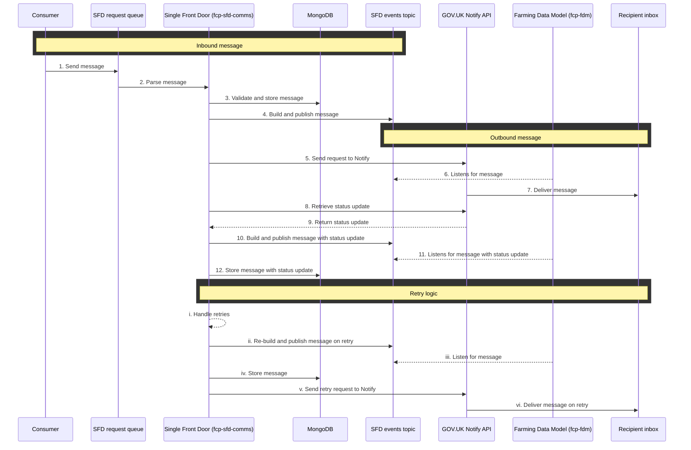
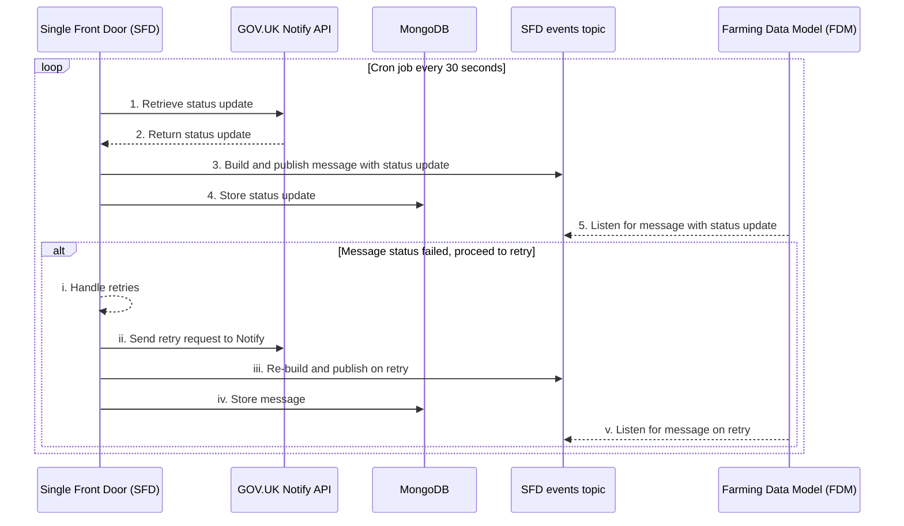

# fcp-sfd-comms

[](https://sonarcloud.io/summary/new_code?id=DEFRA_fcp-sfd-comms)
[](https://sonarcloud.io/summary/new_code?id=DEFRA_fcp-sfd-comms)
[](https://sonarcloud.io/summary/new_code?id=DEFRA_fcp-sfd-comms)

Communications service for the Single Front Door.

This service is part of the [Single Front Door (SFD) service](https://github.com/DEFRA/fcp-sfd-core).

## Architecture overview

## Event processing pipeline

> **API Specification**
> Complete AsyncAPI specification is available at: [`docs/asyncapi0-v1.0.yaml`](/docs/asyncapi-v1.0.yaml).
> Defines all supported inbound events and schemas with examples provided.

### Processing flow inbound messages


```mermaid
sequenceDiagram
    participant CONSUMER as Consumer
    participant SQS as SFD request queue
    participant SFD as Single Front Door (fcp-sfd-comms)
    participant MONGO as MongoDB
    participant SNS as SFD events topic
    participant NOTIFY as GOV.UK Notify API
    participant FDM as Farming Data Model (fcp-fdm)
    participant RECIPIENT as Recipient inbox

    rect
        note over CONSUMER,SNS: Inbound message
    end

    CONSUMER->>SQS: 1. Send message
    SQS->>SFD: 2. Parse message
    SFD->>MONGO: 3. Validate and store message
    SFD->>SNS: 4. Build and publish message

    rect
        note over SNS,RECIPIENT: Outbound message
    end

    SFD->>NOTIFY: 5. Send request to Notify
    FDM-->>SNS: 6. Listens for message
    NOTIFY->>RECIPIENT: 7. Deliver message

    SFD->>NOTIFY: 8. Retrieve status update
    NOTIFY-->>SFD: 9. Return status update
    SFD->>SNS: 10. Build and publish message with status update
    FDM-->>SNS: 11. Listens for message with status update
    SFD->>MONGO: 12. Store message with status update

    rect
        note over SFD,RECIPIENT: Retry logic
    end

    SFD-->>SFD: i. Handle retries
    SFD->>SNS: ii. Re-build and publish message on retry
    FDM-->>SNS: iii. Listen for message
    SFD->>MONGO: iv. Store message
    SFD->>NOTIFY: v. Send retry request to Notify
    NOTIFY->>RECIPIENT: vi. Deliver message on retry
```

### Message processing stages

1. Consumer sends request onto the Single Front Door (SFD) queue: `fcp_sfd_comms_request`.
2. Message is consumed and parsed by the SFD comms service: `fcp-sfd-comms`.
3. Comms service will validate the request against the message schema, check the request being made is idempotent to avoid duplicate requests, and then store the valid message in the SFD's comms database: `fcp_sfd_comms`.
4. Comms builds the message to then be published onto SFD's topic: `fcp_sfd_comm_events`.
5. All topic subscriptions will receive the message. The Farming Data Model (FDM) is currently the only subscriber to SFD's topic.
6. Comms service sends a request to the GOV.UK Notify API alongside the built message which includes the Notify template ID.
7. Message is delivered to the recipient.

Extended details on the cron job for status update retrieval and retry logic is provided below.

### Processing flow for status update retrieval


```mermaid
sequenceDiagram
    participant SFD as Single Front Door (SFD)
    participant NOTIFY as GOV.UK Notify API
    participant MONGO as MongoDB
    participant SNS as SFD events topic
    participant FDM as Farming Data Model (FDM)

    loop Cron job every 30 seconds
        SFD->>NOTIFY: 1. Retrieve status update
        NOTIFY-->>SFD: 2. Return status update
        SFD->>SNS: 3. Build and publish message with status update
        SFD->>MONGO: 4. Store status update
        FDM-->>SNS: 5. Listen for message with status update

        alt Message status failed, proceed to retry
            SFD-->>SFD: i. Handle retries
            SFD->>NOTIFY: ii. Send retry request to Notify
            SFD->>SNS: iii. Re-build and publish on retry
            SFD->>MONGO: iv. Store message
            FDM-->>SNS: v. Listen for message on retry
        end
    end
```

### Status retrieval and retry logic stages

1. Cron job is triggered to run every 30 seconds. First stage is sending a request to the GOV.UK Notify API for a status update.
2. Notify API returns status update to SFD's comms service.
3. Comms service will build and publish the message with the status update onto the SFD topic.
4. Updated message is stored in SFD's comms database.
5. All topic subscribers will listen and consume the updated message.

The `fcp-sfd-comms` service is also configured to handle retries (i) on any messages that fail to be delivered to the recipient. Requests are sent to the Notify API to retry sending the message (ii). In parallel to this, `fcp-sfd-comms` will re-build the message and publish it onto the SFD topic (iii) and store the message in the Mongo database (iv). All topic subscriptions (in this case FDM) will consume the message published onto SFD's topic (v).

## Prerequisites
- Docker
- Docker Compose
- Node.js (v22 LTS)


## Pre-commit Hooks

For local development, this repository includes [`pre-commit` hooks](https://pre-commit.com/). These hooks allow for early identification of issues and vulnerabilities so that the developer can resolve any issues before pushing up to the public repository on GitHub. The hooks include:

- [`detect-secrets`](https://github.com/Yelp/detect-secrets): for detecting and preventing secrets in the codebase being pushed to public/open-source repositories.
- `eslint-fix`: a custom hook for running the linter, ESLint + [neostandard](https://www.npmjs.com/package/neostandard?activeTab=readme), to ensure consistent code formatting and styling and additionally uses the `--fix` option to automatically fix any identified issues where possible to reduce the need for manual correction.

To see the full output of the above hooks it is recommended to commit via the command line as using the source control panel does not provide the same feedback and loses sight of the `pre-commit` logs. All `pre-commit` hooks are listed in the [`.pre-commit-config.yaml`](.pre-commit-config.yaml) configuration file.

For these hooks to successfully apply during local development ensure  Python and its package manager, `pip3`, are installed on your machine. Installation of `pre-commit` can then be completed via `pip3`:

```
pip3 install pre-commit
```

## Environment variables
| Name | Default value | Required | Description |
|-|-|-|-|
| AWS_REGION | eu-west-2 | No | AWS region to access resources in. |
| AWS_DEFAULT_REGION | eu-west-2 | No | Default AWS region to access resources in. |
| AWS_ACCESS_KEY_ID | test | No | AWS Access Key ID. |
| AWS_SECRET_ACCESS_KEY | test | No | AWS Secret Access Key. |
| NOTIFY_API_KEY | n/a - sensitive | Yes | Notify API key to perform API requests to GOV.UK Notify. Generate a test API key for local development and testing on the [GOV.UK Notify portal](https://www.notifications.service.gov.uk/). |
| MONGO_URI | mongodb://mongo:27017/ | No | MongoDB connection string. |
| SQS_ENDPOINT | http://floci:4566 | No | SQS endpoint. |
| SNS_ENDPOINT | http://floci:4566 | No | SNS endpoint. |
| COMMS_REQUEST_QUEUE_URL | http://floci:4566/000000000000/fcp_sfd_comms_request | No | SQS queue URL to send comms requests. |
| COMMS_REQUEST_DEAD_LETTER_QUEUE_URL | http://floci:4566/000000000000/fcp_sfd_comms_request-deadletter | No | Comms Request SQS dead letter queue. |
| COMM_EVENTS_TOPIC_ARN | arn:aws:sns:eu-west-2:000000000000:fcp_sfd_comm_events | No | SNS topic ARN to publish comm events to. |
| FDM_QUEUE_URL | http://floci:4566/000000000000/fcp_fdm_events | No | SQS queue that is subscribed to the events SNS topic. |

## Running the application

We recommend using the [fcp-sfd-core](https://github.com/DEFRA/fcp-sfd-core) repository for local development. You can however run this service independently by following the instructions below using either Docker Compose or the provided [npm scripts](./package.json). Alternatively, for VS Code users, a set of [VS Code tasks](.vscode/tasks.json) are available to use and can be access via the command palette: 

- `Ctrl` + `shift` + `P` on Windows or `Cmd` + `shift` + `P` on Mac.
- Select `Tasks: Run Task`.
- Choose from the available tasks listed.

> ℹ️️ The aws resources created locally are meant to be shared with [fcp-sfd-comms-publisher-stub](https://github.com/DEFRA/fcp-sfd-comms-publisher-stub) when running alongside.
> fcp-sfd-comms can be run independently of fcp-sfd-comms-publisher-stub.

### Build container image

Container images are built using Docker Compose.

```
docker compose build
```

Alternatively, an npm script is available:

```
npm run docker:build
```

### Start

Use Docker Compose to start running the service locally.

```
docker compose up
```

Alternatively, an npm script is available:

```
npm run docker:dev
```

### Test structure

The tests have been structured into sub-folders of `./test` as per the
[Microservice test approach and repository structure](https://eaflood.atlassian.net/wiki/spaces/FPS/pages/1845396477/Microservice+test+approach+and+repository+structure). 

### Running tests

A convenience npm script is provided to run automated tests in a containerised
environment. This will rebuild images before running tests via Docker Compose,
using a combination of the `compose.yaml` and `compose.test.yaml` files.

```
npm run docker:test
```

Tests can also be started in watch mode to support Test Driven Development (TDD):

```
npm run docker:test:watch
```

As mentioned previously, Docker Compose can be used directly for starting tests:

```
docker compose -f compose.yaml -f compose.test.yaml run --rm "fcp-sfd-comms"
```


## Scripts

Utility scripts for querying GOV.UK Notify directly. Useful for operational support and debugging delivery issues.

All scripts require the `NOTIFY_API_KEY` environment variable to be set.

### `notify-find-by-reference`

Looks up notifications by one or more references. Use when error logs lack identifying information and you need to trace specific messages.

```bash
NOTIFY_API_KEY=<key> node scripts/notify-find-by-reference.js --references ref1 ref2 ref3
NOTIFY_API_KEY=<key> node scripts/notify-find-by-reference.js --references ref1 --status delivered
```

| Argument | Required | Description |
|---|---|---|
| `--references` | Yes | One or more reference IDs to look up |
| `--status` | No | Filter by notification status (e.g. `delivered`, `failed`) |

### `notify-find-by-date`

Fetches notifications within a date range. Supports additional filters for status, message type, reference, and template ID.

> **Note:** The Notify API does not support server-side filtering by date or template ID. This script paginates through results and applies these filters client-side.

```bash
NOTIFY_API_KEY=<key> node scripts/notify-find-by-date.js --from 2026-05-01 --to 2026-05-31
NOTIFY_API_KEY=<key> node scripts/notify-find-by-date.js --from 2026-05-01 --status delivered --type email
NOTIFY_API_KEY=<key> node scripts/notify-find-by-date.js --from 2026-05-01 --template-id <uuid>
```

| Argument | Required | Description |
|---|---|---|
| `--from` | Yes | Start date (YYYY-MM-DD) |
| `--to` | No | End date (YYYY-MM-DD). If omitted, includes all messages from `--from` onwards |
| `--status` | No | Filter by notification status |
| `--type` | No | Filter by message type: `email`, `sms`, or `letter` |
| `--reference` | No | Filter by reference |
| `--template-id` | No | Filter by Notify template UUID (client-side) |

## SonarQube Cloud scan

Run a local scan against [SonarCloud](https://sonarcloud.io/project/overview?id=DEFRA_fcp-sfd-comms) for the current git branch. See the [DEFRA SonarCloud guide](https://github.com/DEFRA/cdp-documentation/blob/main/how-to/sonarcloud.md) for organisation access and CI setup.

### Setup

1. Log in to [SonarQube Cloud](https://sonarcloud.io) with your DEFRA GitHub account
2. Go to **My Account → Security → Generate Tokens** and create a personal token
3. Add `SONAR_TOKEN=<your-token>` to your `.env` file
4. Ensure Docker is running

### Run

Generate test coverage first, then scan:

```bash
npm run docker:test
npm run sonar
```

The script uploads results for the current branch and prints:

- Quality gate pass/fail and failed conditions
- Open issues on new code (when the gate fails)
- **Accepted / false-positive issues without comment** — DEFRA quality gates require a justification comment on each suppressed issue; add comments in SonarCloud under the issue **Activity** tab

Exit code is `0` when the gate passes and all suppressed issues are commented, `1` otherwise.

## Licence

THIS INFORMATION IS LICENSED UNDER THE CONDITIONS OF THE OPEN GOVERNMENT LICENCE found at:

<http://www.nationalarchives.gov.uk/doc/open-government-licence/version/3>

The following attribution statement MUST be cited in your products and applications when using this information.

> Contains public sector information licensed under the Open Government license v3

### About the licence

The Open Government Licence (OGL) was developed by the Controller of His Majesty's Stationery Office (HMSO) to enable information providers in the public sector to license the use and re-use of their information under a common open licence.

It is designed to encourage use and re-use of information freely and flexibly, with only a few conditions.
